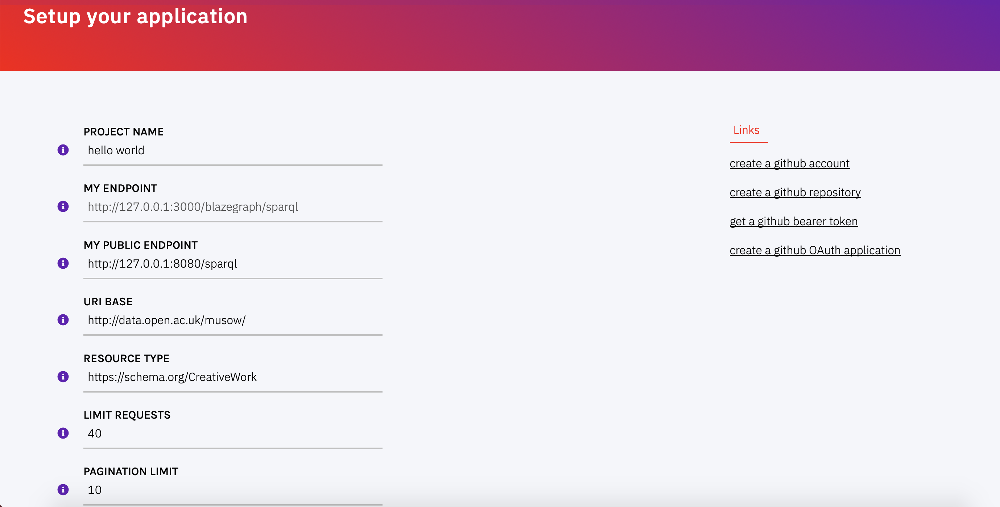
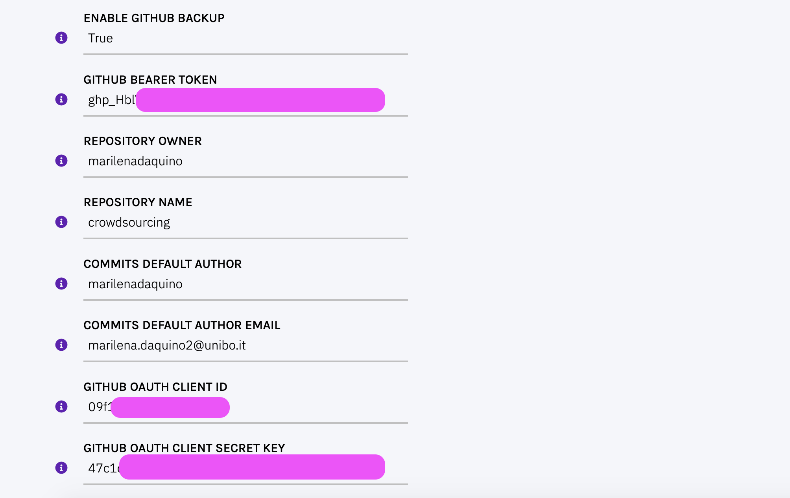
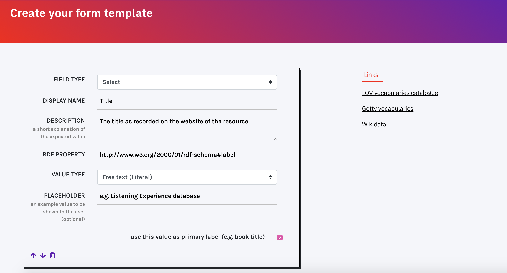

# CLEF. Crowdsourcing Linked Entities via web Form

CLEF (*Crowdsourcing Linked Entities via web Form*) is a lightweight Linked Open Data native cataloguing system tailored for small-medium crowdsourcing projects.

## Table of Contents

 - [Introduction](#introduction)

 - [Requirements](#requirements)

 - [Install and run](#install-and-run)

   - [Mac](#mac)

      - [With the installer](#with-the-installer)

      - [From source](#from-source)

      - [With Docker](#with-docker)

   - [Windows](#windows)

      - [With Vagrant](#with-vagrant)

 - [Customize](#customize)

   - [Setup](#setup)

      - [Data backup on Github](#data-backup-on-github)

      - [User authentication with Github](#user-authentication-with-github)

   - [Form template](#form-template)

   - [Tutorial](#tutorial)

   - [Access data](#access-data)

   - [Limitations](#limitations)

## Introduction

 Content management system

  - reuse of wikidata

editorial process

Crowdsourcing: github authentication and anonymous contribution

local and remote

SPARQL endpoint

Why to use it? use case (multiple contributors to github,  lightweight cms easy to install)


## Requirements

github or not

## Install and run

### Mac

**With the installer**

 * download `install` from the latest release

 * in the terminal, change the permissions `chmod 755 path/to/install`

 * run the script `./install.sh`. The installer clones the repository in the folder `/Users/{USERNAME}/crowdsourcing`, creates a virtual environment, installs dependencies, and downloads blazegraph triplestore.

 * open the folder `/Users/{USERNAME}/crowdsourcing` and run the executable script `run.sh`

 * open your browser at http://0.0.0.0:8080/

 * follow the instructions for [customization](#customize)

**From source**

_(No virtualenv for simplicity)_

 * download the source code from the latest release or clone the repository

 * install `requirements.txt` with pip (`pip3 install requirements.txt`)

 * download the latest version of blazegraph [link](https://github.com/blazegraph/database/releases/tag/BLAZEGRAPH_2_1_6_RC) and move the file `blazegraph.jar` in the root folder of the cloned repository

 * in the terminal, launch blazegraph `java -Dfile.encoding=UTF-8 -Dsun.jnu.encoding=UTF-8 -server -Xmx2g -Djetty.port=3000 -Dbigdata.propertyFile=blaze.properties -jar blazegraph.jar` (NB. `-Xmx2g` requires 2GB RAM, change according to your preference)

 * launch the web application `python3 app.py 8080`

 * open your browser at http://0.0.0.0:8080/

 * follow the instructions for [customization](#customize)

**With Docker**

 * install Docker on your system

   - [Windows](https://docs.docker.com/desktop/windows/install/) - update to the newest version of Windows to ensure that Docker can be installed. For example, if you have a Windows Home, ensure you have at [least the version 2004](https://golb.hplar.ch/2020/05/docker-windows-home-2004.html)

   - [macOs](https://docs.docker.com/desktop/mac/install/)

   - [Linux](https://docs.docker.com/engine/install/)

 * clone or download the repository

   - with [git](https://git-scm.com/downloads) for easier installation and update (optional, recommended) ```git clone https://github.com/marilenadaquino/crowdsourcing.git```

   - or [download the zip repository](https://github.com/marilenadaquino/crowdsourcing/archive/refs/heads/main.zip) and unpack it.

   - no extra action is needed for configuration. The configuration is loaded from `conf.py`. The only difference regards the set up of the endpoints for Blazegraph and the application (in two containers). This is set in `docker-compose.yml` by two properties:

      - ```BLAZEGRAPH_ENDPOINT=http://db:8080/bigdata/sparql```
      - ```PUBLIC_BLAZEGRAPH_ENDPOINT=http://localhost:8080/sparql```

 * ensure that your Docker engine is running

 * run ```docker compose up``` (the first build might take couple of minutes)

 * access your web browser at [http://localhost:8080](http://localhost:8080)

 * follow the instructions for [customization](#customize)


### Windows

**With Vagrant**

 * ensure you have [VirtualBox](https://www.virtualbox.org/wiki/Downloads)

 * ensure you have [Vagrant](https://www.vagrantup.com/downloads.html)

 * clone the repository

 * cd into the repository and run ```vagrant up```

 * access your web browser at [http://localhost:8080](http://localhost:8080)

 * follow the instructions for [customization](#customize)


## Customize

### Setup

When running the application for the first time, a web page is shown to setup basic configuration. The setup web page is also available in the Member area (the backend) of the application.

Changes to the config file have immediate effect (no need to restart the application). The config file (`conf.py`) is in the root folder of the application, and can be directly modified.




 - **MY ENDPOINT** (default `http://127.0.0.1:3000/blazegraph/sparql`, readonly value) the local URL of your SPARQL endpoint. Changes are disabled. To modify the default port you'll have to modify the following files:

    * change `myEndpoint` in `conf.py`

    * if you are running the application from source code, change also the running command

    * if you are running the app in docker, change also `docker-compose.yml`

    * if you are running the app with the bash script, change also `run.sh`

    * if you are running the app in Vagrant, change `Vagrantfile`


 Similarly, to change the port of the web application, change the files.

 - **MY PUBLIC ENDPOINT** (default `http://127.0.0.1:3000/blazegraph/sparql`) the public URL of your SPARQL endpoint (for front-end functionalities, e.g. autocomplete).

  * If you are running the application locally, this value must be the same as **MY ENDPOINT**.

  * If run remotely, the web application provides an out-of-the-box read-only SPARQL endpoint at `{YOURDOMAIN}/sparql`. Use this URL.

  * if you are running the app in docker, change `docker-compose.yml`

 - **URI BASE** the URI base of new resources. Be aware that dereferencing methods are not provided. Use persistent URI providers (e.g. [w3id](https://w3id.org/)).

 - **RESOURCE TYPE** The OWL Class of resources to be described. Currently, CLEF allows you to describe *only one type of resource*.

 - **LIMIT REQUESTS** (default `40`) Limit the number of anonymous contributions per day by IP address.

 - **PAGINATION LIMIT** (default `10`) The number of resources to be displayed per page. It affects both backend (the list of records) and frontend.

#### Data backup on Github

**[OPTIONAL]** If the application runs with github authentication and/or data backup on a github repository, fill in the following fields. The backup on github works when both running the application locally or remotely.

**Requirements**

In order to work with github backup enabled, you'll need:

 * a github account

 * a github repository you own or are collaborator of. The repository must include a folder called `records`

 * a bearer token with `repo` permissions.

 * fill in the following fields in the web page Setup




 - **ENABLE GITHUB BACKUP** (`True|False`, default `False`) Backup data on a selected github repository and update the repo every time a change happens in the application. (\*)

 - **GITHUB BEARER TOKEN** A bearer token associated to your github account with `repo` permissions. To generate a token, follow [github instructions](https://docs.github.com/en/authentication/keeping-your-account-and-data-secure/creating-a-personal-access-token). Select expiry date and `repo` as scope.

 - **REPOSITORY OWNER** The owner of the repository where to backup data, as it appears in the URL of the repo. May be an organisation or a user.

 - **REPOSITORY NAME** The name of the repository where to backup data, as it appears in the URL of the repo. May be a public or private repository.

 - **COMMITS DEFAULT AUTHOR** The name of the github user that will perform operations on the repository. Be aware that the author *MUST BE* either the owner or a collaborator (with write permissions) of the selected repository.

 - **COMMITS DEFAULT AUTHOR EMAIL** The email of the github user that will perform operations on the repository. Use the email associated with the github profile.


(\*) If **ENABLE GITHUB BACKUP** is `True`, fields **GITHUB BEARER TOKEN**, **REPOSITORY OWNER**, **REPOSITORY NAME**, **COMMITS DEFAULT AUTHOR**, and **COMMITS DEFAULT AUTHOR EMAIL**, must be filled in.

If **ENABLE GITHUB BACKUP** is `False`, access to the member area will be possible in anonymous mode, i.e. no other authentication method is provided, and records could be modified by anybody. **DO NOT USE IN PRODUCTION SERVER!**

#### User authentication with Github

**[OPTIONAL]** When the application runs remotely and multiple authors want to contribute in non anonymous mode, e.g. modifying existing records that are accessible from the member area only, github authentication can be used to allow and restrict access to selected members.

**Requirements**

In order to work with github authentication, you'll need:

 * a **Github OAuth application**, which allows users of the web app to login via their github credetials (instructions [here](https://docs.github.com/en/developers/apps/building-oauth-apps/creating-an-oauth-app)).

 * the two codes (**Client ID** and **Secret Key**) generated by the Github OAuth app.

Fill in the last two fields of the web page Setup:

 - **GITHUB OAUTH CLIENT ID** The public Client ID generated when creating a Github OAuth application.

 - **GITHUB OAUTH CLIENT SECRET KEY** The secret key generated when creating a Github OAuth application.

When modifying records from your application, a commit to the repository will be performed with the user credentials. Therefore members MUST be collaborators of the repository **REPOSITORY OWNER**/**REPOSITORY NAME** specified above. To manage new members use github, e.g. via issue tracker or invitation.

When the OAuth app is correctly configured and linked to your application, the button in the menu will show the Github icon.


### Form template

After setting up the app for the first time, you are redirected to a web page to customise your form template. The page is available also from the Member area (Template).  

Changes have immediate effect (no need to restart the application). The template is stored in a JSON file `myform.json`, which can be directly modified.



For each field, a box is shown with basic information to be filled in. All types of field share the following information

 * **FIELD TYPE** (values `Textbox|Dropdown|Checkbox`). Specify the appearance of the field. Textboxes allow the user to provide either short free text descriptions (e.g. a title) or to reference entities (e.g. multiple authors) available in the catalogue or in Wikidata. Dropdowns allow the selection of a single value from a controlled vocabulary. Checkboxes allow the selection of multiple values from a controlled vocabulary.

 * **DISPLAY NAME** The title of the field to be displayed to the user. May not coincide with the RDF property label.

 * **DESCRIPTION** A brief description of the field and expected value to be shown (as a tooltip) to the user.

 * **RDF PROPERTY** The mapping to a RDF property for creating the triple. The system does not enforce the usage of existing vocabularies, but it is highly recommended.

#### Textbox

When **FIELD TYPE** is set to `Textbox`, the following fields appear.

 * **VALUE TYPE** (`Free text|Entity`) Specify whether the value of the field is a string or an entity (i.e. RDF property is a data property or an object property).

 * **PLACEHOLDER** an example value to be shown to the user.

**Free text (Literal) values**


If the value is set to `Free text (Literal)`, a checkbox is shown at the bottom of the box. If checked, the value of this field is mandatory (i.e. cannot be left blank by users) and it is used as a title to be shown in the record web page. Only one field can be flagged as primary label.

The final field will appear as follows.


**Entity (URI from Wikidata or catalogue) values**


If the value is set to, the textbox will provide autocomplete suggestions while typing. Suggested entities are queried from Wikidata and, if no result is found in Wikidata, from the catalogue.


#### Dropdown

#### Checkbox
 * ****

**Add / move / delete fields**

#### The form `myform.json`

So far, only text boxes and dropdowns (select) are supported.  

**Textbox**

Example

```
{
  "type":"Textbox",
  "id":"resource_title", # unique id of the field, DO NOT USE "_label"
  "label":"Title", # field name shown to users
  "placeholder":"e.g. Listening Experience database",
  "prepend":"The title as recorded on the website of the resource",
  "disabled":"False", # True|False if the input is disabled
  "class":"col-md-11",
  "searchWikidata":"False", # True|False lookup into Wikidata and the dataset
  "cache_autocomplete":"off", # if the prior is True, this should be False
  "property":"http://www.w3.org/2000/01/rdf-schema#label", # absolute URI of the property
  "value":"Literal", # Literal|URI the type of value (if searchWikidata is True, set value as URI)
  "disambiguate":"True", # True|False if True, this field value is used to disambiguate new entries (to prevent users creating duplicates) and to assign a title to the named graph
  "browse":"True" # True|False if you want records sorted by this field in the Explore page
}
```

When `searchWikidata` is True, multiple values are allowed (e.g. multiple creator names). If no match is found in Wikidata or the dataset, new entities are created with the base URI specified in configs.

**Dropdown**

Example

```
{
  "type":"Dropdown",
  "id":"resource_type",
  "label":"Type",
  "prepend":"The type of resource described, choose from the list",
  "disabled":"False",
  "class":"col-md-11",
  "cache_autocomplete":"off",
  "property":"http://purl.org/spar/datacite/hasGeneralResourceType",
  "value":"URI", # always use a controlled vocabulary
  "values":{
      "http://data.open.ac.uk/musow/type/33fcf2b3ec4686d9cd06051c726d0ba2":"Repository",
      "http://data.open.ac.uk/musow/type/7146a60667b422e69fd050fe1df6859a":"Schema",
      "http://data.open.ac.uk/musow/type/520d0db389f362bf79ef56ca0af3dcab":"Format"
    },
  "disambiguate":"False",
  "browse":"True" # True|False if you want records grouped by this field in the Explore page
}
```

For each `key,value` in `values` a triple `<key rdfs:label value>` is uploaded in a dedicated named graph called `base+'vocabularies/'`. Dropdowns allow only one term to be selected.

#### The dataset

Every new resource is associated with the class specified in the config file.

For every new record (resource) a named graph is generated, which includes triples all having the same subject `<resourceURI>`. The named graph appears in the form `<resourceURI/>` (final slash added). Basic provenance is associated to graphs (creators, modifiers, dates, publication stage).

SPARQL endpoint

Data dump on github

## Limitations

Web form

 * You can describe **only one type of resource**, as it happens in many cataloguing systems.

 * You can setup **only one template** form for describing your resources.

 * You can specify **only one class** to be associated to the resource (from the Setup page).

 * When creating the template, **only one field** can be enforced as mandatory, that is, the one for disambiguation purposes.

 * The integration with external Linked Open dataset is currently limited to **Wikidata only**.

 * controlled vocabularies can only be **custom lists** prepared by the user. No import mechanisms are available.

Authentication

 * no **authentication methods** other than github are currently implemented.

Data

 * RDF data can be served via a built-in SPARQL endpoint and via a data dump on github. However, **dereferencing mechanisms** are not provided.

 * when entering data about a resource **only binary relations** can be recorded. That is, no property chains can be used to relate subjects to objects.

 * while the system does not prevent a user to create new properties or classes, **custom ontologies** are not fully supported (i.e. these are not dereferenced)

 * no automatic **import mechanisms** are currently implemented. To import data, you'll need to check data consistency autonomously and import data in the triplestore. Likewise, versioning of this data is not ensured in github if the application runs with github backup enabled.

Explore interface

 * the Explore page supports **filters on URI values only**. String values cannot be used to automatically generate filters.

Limits are opportunities. Contribute to CLEF!
