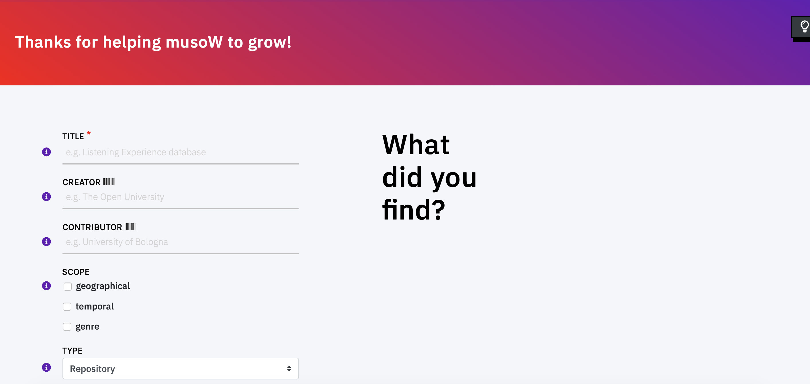
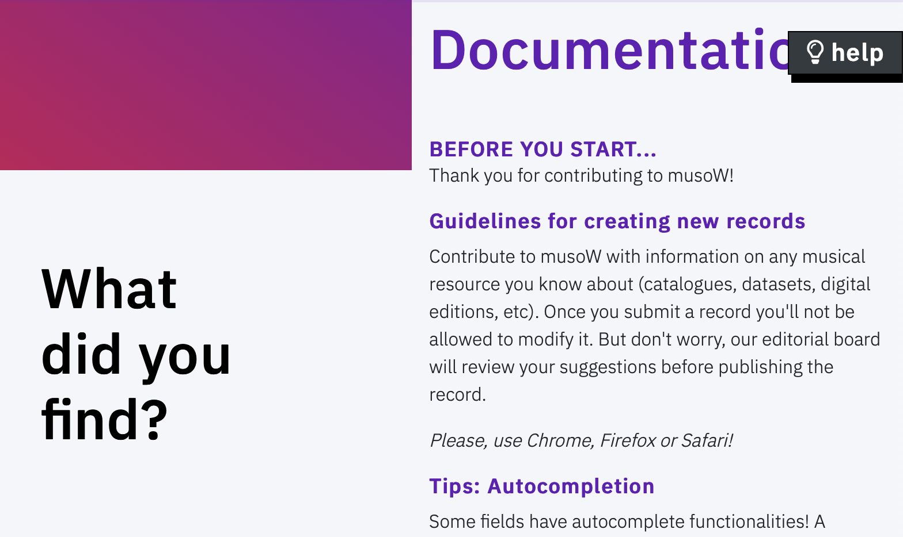
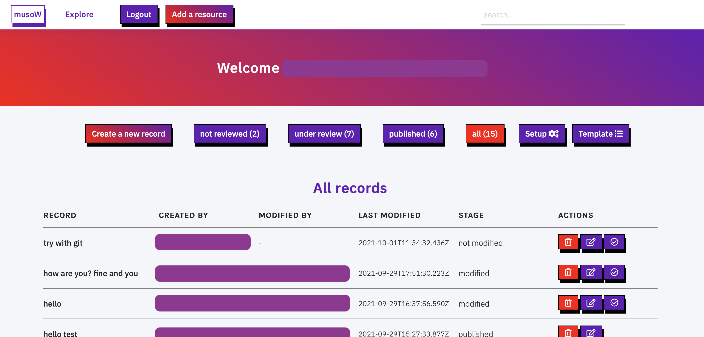
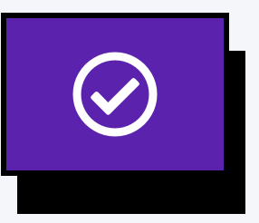
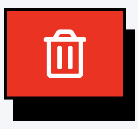
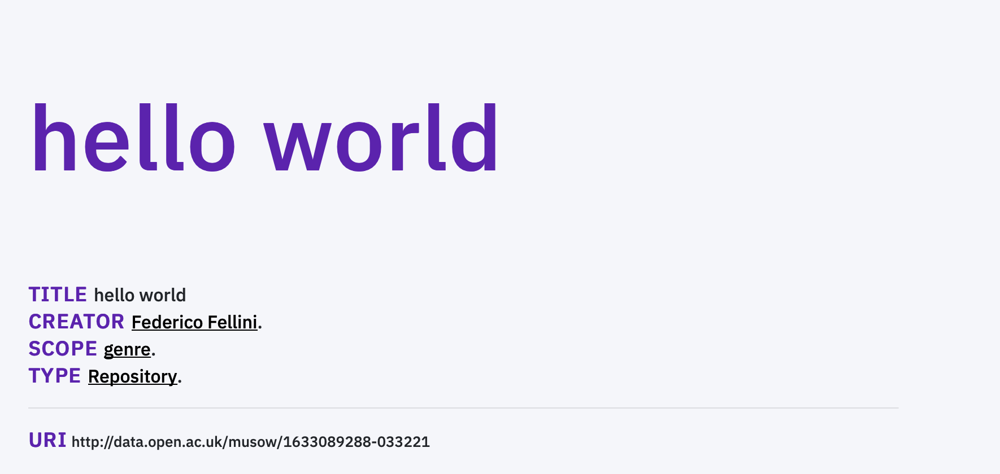
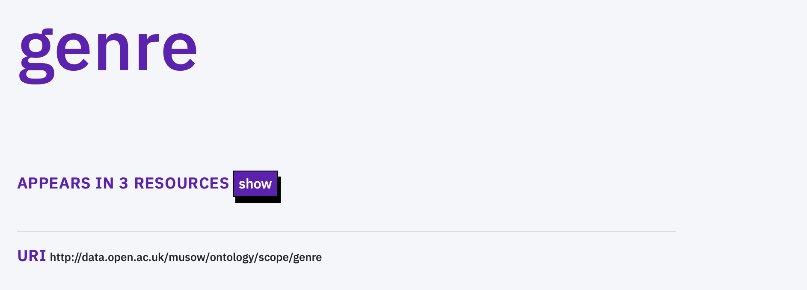
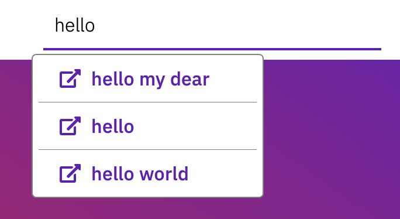

# CLEF. Crowdsourcing Linked Entities via web Form

CLEF (*Crowdsourcing Linked Entities via web Form*) is a lightweight Linked Open Data native cataloguing system tailored to small-medium crowdsourcing projects.

## Table of Contents

 - [Introduction](#introduction)
 - [Install and run](#install-and-run)
   - [Mac](#mac)
      - [With the installer](#with-the-installer)
      - [From source](#from-source)
      - [With Docker](#with-docker)
   - [Windows](#windows)
      - [With Vagrant](#with-vagrant)
 - [Customize](#customize)
   - [Setup](#setup)
      - [Data backup on Github](#data-backup-on-github)
      - [User authentication with Github](#user-authentication-with-github)
   - [Form template](#form-template)
      - [Textbox](#textbox)
      - [Dropdown and checkbox](#dropdown-and-checkbox)
      - [Add fields](#add-fields)
      - [Move and delete fields](#move-and-delete-fields)
   - [Static contents](#static-contents)
 - [Get started](#get-started)
      - [Overview](#overview)
      - [Create a record](#create-a-record)
        - [The data entry interface](#the-data-entry-interface)
        - [The editorial process](#the-editorial-process)
      - [Visualize records](#visualize-records)
      - [Explore the catalogue](#explore-the-catalogue)
        - [Text search](#text-search)
 - [Access data](#access-data)
      - [The dataset](#the-dataset)
      - [The data model](#the-data-model)
      - [User interface](#user-interface)
      - [SPARQL endpoint](#sparql-endpoint)
      - [Data backup on github](#data-backup-on-github)
 - [Deployment](#deployment)
 - [Limitations](#limitations)

## Introduction

CLEF is a lightweight content management system that allows users to easily deploy online solutions for collaborative projects.

With CLEF users can setup crowdsourcing campaigns, ensure quality of data collected, and showcase results thanks to a built-in web application for browsing and exploration.

Some highlights:

  - **customisable**: create your template for data collection
  - **collaborative**: allow everybody to contribute to your catalogue
  - **peer-reviewed contents**: allow a restricted number of people to review records before publication
  - **consistent data**: ensure collaborators reference the same contents using Wikidata for autocomplete suggestions
  - **authentication and backup powered by github**: use github to authenticate reviewers and to backup your data
  - **release 5-star data** in CLEF data is stored, served, and queried as Linked Open Data.
  - **show results immediately** CLEF comes with an online browsable catalogue, that can be immediately explored (no need to develop another application for showcasing your data!)
  - **local or remote** use it from your desktop or on a remote server.

## Install and run

### Mac

**With the installer**

 * download `install` from the latest release
 * open the terminal, change the permissions to the file `chmod 755 Downloads/install`
 * in the terminal, run the script `./install.sh`. The installer clones the repository in the folder `/Users/{USERNAME}/Desktop/crowdsourcing`, creates a virtual environment, installs dependencies, and downloads blazegraph triplestore.
 * open the folder `/Users/{USERNAME}/Desktop/crowdsourcing` and run the executable script `run.sh` (double click)
 * open your browser at http://0.0.0.0:8080/
 * follow the instructions for [customization](#customize)

See section [Setup](#setup) for detail on how to change default ports.

**From source**

_(No virtualenv)_

 * download the source code from the latest release or clone the repository
 * install `requirements.txt` with pip (`pip3 install requirements.txt`)
 * download the latest version of blazegraph [link](https://github.com/blazegraph/database/releases/tag/BLAZEGRAPH_2_1_6_RC) and move the file `blazegraph.jar` in the root folder of the cloned repository
 * in the terminal, launch blazegraph `java -Dfile.encoding=UTF-8 -Dsun.jnu.encoding=UTF-8 -server -Xmx2g -Djetty.port=3000 -Dbigdata.propertyFile=blaze.properties -jar blazegraph.jar` (NB. `-Xmx2g` requires 2GB RAM, change according to your preference)
 * launch the web application `python3 app.py 8080`
 * open your browser at http://0.0.0.0:8080/
 * follow the instructions for [customization](#customize)

See section [Setup](#setup) for detail on how to change default ports.

**With Docker**

 * install Docker on your system

   - [Windows](https://docs.docker.com/desktop/windows/install/) - update to the newest version of Windows to ensure that Docker can be installed. For example, if you have a Windows Home, ensure you have at [least the version 2004](https://golb.hplar.ch/2020/05/docker-windows-home-2004.html)
   - [macOs](https://docs.docker.com/desktop/mac/install/)
   - [Linux](https://docs.docker.com/engine/install/)

 * clone or download the repository

   - with [git](https://git-scm.com/downloads) for easier installation and update (optional, recommended) ```git clone https://github.com/marilenadaquino/crowdsourcing.git```
   - or [download the zip repository](https://github.com/marilenadaquino/crowdsourcing/archive/refs/heads/main.zip) and unpack it.
   - no extra action is needed for configuration. The configuration is loaded from `conf.py`. The only difference regards the set up of the endpoints for Blazegraph and the application (in two containers). This is set in `docker-compose.yml` by two properties:

      - ```BLAZEGRAPH_ENDPOINT=http://db:8080/bigdata/sparql```
      - ```PUBLIC_BLAZEGRAPH_ENDPOINT=http://localhost:8080/sparql```

 * ensure that your Docker engine is running
 * run ```docker compose up``` (the first build might take couple of minutes)
 * access your web browser at [http://localhost:8080](http://localhost:8080)
 * follow the instructions for [customization](#customize)

See section [Setup](#setup) for detail on how to change default ports.

<hr>

### Windows

**With Vagrant**

 * ensure you have [VirtualBox](https://www.virtualbox.org/wiki/Downloads)
 * ensure you have [Vagrant](https://www.vagrantup.com/downloads.html)
 * clone the repository
 * cd into the repository and run ```vagrant up```
   - The first time this command will take longer, as the underlying virtual machine needs to be downloaded and provisioned. The second time, the provisioning is skipped and the runtime is much faster.
 * access your web browser at [http://localhost:8080](http://localhost:8080)
 * follow the instructions for [customization](#customize)
 * If you change the configuration or update the git repository, [reload the running vagrant](https://www.vagrantup.com/docs/cli/reload)
    - ```vagrant reload```


See section [Setup](#setup) for detail on how to change default ports.

## Customize

### Setup

When running the application for the first time, a web page is shown to setup basic configuration. The setup web page is also available from the Member area (the backend) of the application.

Changes to the config file have immediate effect (no need to restart the application). The config file (`conf.py`) is in the root folder of the application, and can be directly modified.


 - **MY PROJECT** the short name of your project, to be shown in the menu and across pages
 - **MY ENDPOINT** (default `http://127.0.0.1:3000/blazegraph/sparql`, readonly value) the local URL of your SPARQL endpoint. Changes are disabled. To modify the default port you'll have to modify the following files:

    * change `myEndpoint` in `conf.py`
    * if you are running the application from source code, change also the running command
    * if you are running the app in docker, change also `docker-compose.yml`
    * if you are running the app with the bash script, change also `run.sh`
    * if you are running the app in Vagrant, change `Vagrantfile`


 Similarly, to change the port of the web application, change the files.

 - **MY PUBLIC ENDPOINT** (default `http://127.0.0.1:3000/blazegraph/sparql`) the public URL of your SPARQL endpoint (for front-end functionalities, e.g. autocomplete).

    * If you are running the application locally, this value must be the same as **MY ENDPOINT**.
    * If run remotely, the web application provides an out-of-the-box read-only SPARQL endpoint at `{YOURDOMAIN}/sparql`. Use this URL.
    * if you are running the app in docker, change `docker-compose.yml`

 - **URI BASE** the URI base of new resources. Be aware that dereferencing methods are not provided. Use persistent URI providers (e.g. [w3id](https://w3id.org/)).

 - **RESOURCE TYPE** The OWL Class of resources to be described. Currently, CLEF allows you to describe *only one type of resource*.

 - **LIMIT REQUESTS** (default `40`) Limit the number of anonymous contributions per day by IP address.

 - **PAGINATION LIMIT** (default `10`) The number of resources to be displayed per page. It affects both backend (the list of records) and frontend.

<hr>

#### Data backup on Github

**[OPTIONAL]** If the application runs with github authentication and/or data backup on a github repository, fill in the following fields. The backup on github works when both running the application locally or remotely.

**Requirements**

In order to work with github backup enabled, you'll need:

 * a github account
 * a github repository you **own**. The repository must include a folder called `records`
 * a bearer token with `repo` permissions.
 * fill in the following fields in the web page Setup


 - **ENABLE GITHUB BACKUP** (`True|False`, default `False`) Backup data on a selected github repository and update the repo every time a change happens in the application. (\*)
 - **GITHUB BEARER TOKEN** A bearer token associated to your github account with `repo` permissions. To generate a token, follow [github instructions](https://docs.github.com/en/authentication/keeping-your-account-and-data-secure/creating-a-personal-access-token). Select expiry date and `repo` as scope.
 - **REPOSITORY OWNER** The owner of the repository where to backup data, as it appears in the URL of the repo. May be an organisation or a user.
 - **REPOSITORY NAME** The name of the repository where to backup data, as it appears in the URL of the repo. May be a public or private repository.
 - **COMMITS DEFAULT AUTHOR** The name of the github user that will perform operations on the repository. Be aware that the author *MUST BE* either the owner or a collaborator (with write permissions) of the selected repository.
 - **COMMITS DEFAULT AUTHOR EMAIL** The email of the github user that will perform operations on the repository. Use the email associated with the github profile.


(\*) If **ENABLE GITHUB BACKUP** is `True`, fields **GITHUB BEARER TOKEN**, **REPOSITORY OWNER**, **REPOSITORY NAME**, **COMMITS DEFAULT AUTHOR**, and **COMMITS DEFAULT AUTHOR EMAIL**, must be filled in.

If **ENABLE GITHUB BACKUP** is `False`, access to the member area will be possible in anonymous mode, i.e. no other authentication method is provided, and records could be modified by anybody. **DO NOT USE IN PRODUCTION SERVER!**

<hr>

#### User authentication with Github

**[OPTIONAL]** When the application runs remotely and multiple authors want to contribute in non anonymous mode, e.g. modifying existing records that are accessible from the member area only, github authentication can be used to allow and restrict access to selected members.

**Requirements**

In order to work with github authentication, you'll need:

 * a **Github OAuth application**, which allows users of the web app to login via their github credetials (instructions [here](https://docs.github.com/en/developers/apps/building-oauth-apps/creating-an-oauth-app)).
 * the two codes (**Client ID** and **Secret Key**) generated by the Github OAuth app.
 * if the repository is part of an organisation, the OAuth app must request approval to the organisation owners (see [instructions for sending the request](https://docs.github.com/en/account-and-profile/setting-up-and-managing-your-github-user-account/managing-your-membership-in-organizations/requesting-organization-approval-for-oauth-apps)) and must be enabled by the organisation owner (see [instructions for organisation owners](https://docs.github.com/en/organizations/restricting-access-to-your-organizations-data/approving-oauth-apps-for-your-organization)).

Fill in the last two fields of the web page Setup:

 - **GITHUB OAUTH CLIENT ID** The public Client ID generated when creating a Github OAuth application.
 - **GITHUB OAUTH CLIENT SECRET KEY** The secret key generated when creating a Github OAuth application.

When modifying records from your application, a commit to the repository will be performed with the user credentials. Therefore members MUST be collaborators of the repository **REPOSITORY OWNER**/**REPOSITORY NAME** specified above. To manage new members use github, e.g. via issue tracker or invitation.

When the OAuth app is correctly configured and linked to your application, the button in the menu will show the Github icon.


### Form template

After setting up the app for the first time, you are redirected to a web page to customise your form template. The page is available also from the Member area (Template).  

Changes have immediate effect (no need to restart the application). The template is stored in a JSON file `myform.json`, which can be directly modified.


For each field, a box is shown with basic information to be filled in. All types of field share the following information

 * **FIELD TYPE** (values `Textbox|Dropdown|Checkbox`). Specify the appearance of the field. Textboxes allow the user to provide either short free text descriptions (e.g. a title) or to reference entities (e.g. multiple authors) available in the catalogue or in Wikidata. Dropdowns allow the selection of a single value from a controlled vocabulary. Checkboxes allow the selection of multiple values from a controlled vocabulary.
 * **DISPLAY NAME** The title of the field to be displayed to the user. May not coincide with the RDF property label.
 * **DESCRIPTION** A brief description of the field and expected value to be shown (as a tooltip) to the user.
 * **RDF PROPERTY** The mapping to a RDF property for creating the triple. The system does not enforce the usage of existing vocabularies, but it is highly recommended. Each field _MUST_ be mapped to a different RDF property.

<hr>

#### Textbox

When **FIELD TYPE** is set to `Textbox`, the following fields appear.

 * **VALUE TYPE** (`Free text|Entity`) Specify whether the value of the field is a string or an entity (i.e. RDF property is a data property or an object property).
 * **PLACEHOLDER** an example value to be shown to the user.

**Free text (Literal) values**


When **VALUE TYPE** is set to `Free text (Literal)`, a checkbox is shown at the bottom of the box (`use this value as primary label`). If checked, the value of this field is mandatory (i.e. cannot be left blank by users) and it is used as a title to be shown in the record web page. Only one field can be flagged as primary label.

The final field appears as follows.


**Entity (URI from Wikidata or catalogue) values**


When **VALUE TYPE** is set to `Entity (URI from Wikidata or catalogue)`, a checkbox is shown at the bottom of the box (`use this value as a filter in Explore page`). When checked, a filter based on values of this field is created in the `Explore` page.

The final textbox appears as follows.


While typing, autocomplete suggestions are shown. Suggested entities are retrieved from Wikidata and, if no result is found in Wikidata, from the catalogue.

<hr>

#### Dropdown and checkbox

When **FIELD TYPE** is set to `Dropdown` or `Checkbox`, the following fields appear.

 * **VALUES** a list of terms to populate the dropdown. Every row includes values in the form `URI, label`, e.g. `http://example.org/myvalue, my value`. Include only one value per row.
 * `use this value as a filter in Explore page` checkbox. When checked, a filter based on values of this field is created in the `Explore` page.

Dropdowns appear as follows. The user can select only one value from the list.


Checkboxes appear as follows. The user can select multiple values.


<hr>

#### Add fields

To add a new field to your template, use the buttons at the bottom of the page.


<hr>

#### Move and delete fields

Fields can be sorted and reshuffled. Move fields up and down with the arrows at the bottom of the box. To delete a field use the bin icon.  


### Static contents

Static contents of the web application are in the folder `static`. These include stylesheets, javascript code and images

```
/static
  /css
    ...
    main.css # the main css stylesheet of the application
  /js
    main.js # the main js script of the application
  /imgs
```

#### Modifying web pages

The name of the project is stored in the configuration file. To recall the variable name in web pages, use the variable `$project`.

Web pages templates are available in the folder `templates/`. All pages are based on a shared template called `layout.html`, which includes menu, header, and footer.

The public homepage of the application is called `login.html`, while the member area welcome page is called `index.html`.

_NB. Once you are logged in, the public home page is replaced by the member area welcome page. Logout to see the public homepage_

## Get started

### Overview

The web application comes with the following pages:

 * **Homepage** - a landing page presenting the project. The HTML content can be changed by modifying `templates/login.html`
 * **Explore** - a page automatically generated from filters selected in Template. For each selected filter a section is shown.
 * **Member area** - the backend of the application. Can be accessed via github authentication or, if not applicable, in anonymous mode. The welcome page shows the list of created records, and the actions possible on those (modify / publish / delete). From here, users can modify the Setup of the application and the form template.
 * **Add a resource** - create a new record in anonymous mode. To create a record with user credentials, access the member area via github authentication first.
 * **SPARQL endpoint** a GUI for querying against data in SPARQL (link in footer)
 * **Data dodel** the specifications of the ontology terms used in the template (link in footer)
 * **Editorial guidelines** Tips for creating new records (link in footer and available in the right sidebar when creating a record)


### Create a record

Users can create a new record in two modalities: anonymous mode or authenticated user.

**Anonymous mode**

Use the button `Add a resource` in the top menu. The user is not authenticated, and their information is not stored. The IP address of the user is tracked and a limited number of new records can be created per day.

**Authenticated user**

Use the button `Member area` in the top menu to authenticate via github. Then use the button `Add a resource` in the top menu or the top-left button `Create a new record` available in the backend. Only users that are collaborators of the organisation and/or repository bind to the project can use this method.

#### The data entry interface



The page shows the pre-defined template. On the top-right, a bulb icon shows a shortcut to the editorial guidelines and tips for data entry. Click on the icon to toggle the helper.



Each field includes three main elements: field label, info icon, input area.

**Field label**

The label of the field.

If followed by `*`, the field is mandatory and it is used to disambiguate records. While typing, a lookup service search the catalogue to suggest similar records and prevent data duplication.


The lookup does not enforce the user decision in case a new resource matches with exiting ones.

**Info icon**

A tooltip that shows a description of the expected value when hovering with the mouse.


**Input area**

Can be a free-text field, a dropdown, or a checkbox.

If followed by **Wikidata** icon, an autocomplete service is called while typing and the user is encouraged to reuse terms from Wikidata. Terms from the catalogue are also suggested.


To accept a suggestion, click on the link in the result (e.g. `Federico Fellini`). The selected value appears under the input area (highlighted in violet).


To reject suggestions and create a new value, press enter and the new value will appear under the input area (highlighted in orange).


Multiple values are accepted. Terms can be deleted by pressing on the `x`.

<hr>

#### The editorial process

Records are accessible via the member area to authenticated users. Records are paginated and sorted by date (from the most recent to the oldest).



The backend shows first a list of **actions and filters** on the list of records.


The list of records can be filtered by publication status (`not reviewed`, `under review` and `published`). The buttons `Setup` and `Template` redirect the user to the web pages to modify the configuration of the application and the form template respectively.

Records, regardless these are provided by anonymous or authenticated contributors, must be reviewed at least once before being published. Before being reviewed, the record does not appear neither in the [Explore page](#explore-the-catalogue) nor in the dedicated [web page](#visualize-records).

There are two options to modify a record.

**Modify a record**

  

The button `modify` in the column `ACTIONS` allows a reviewer to modify a record. When clicking, the template is shown, filled in with data, and values can be modified. After saving changes, the reviewer's name appears in the backend, in the column `modified by` and the status changes to `modified`.

Once it is reviewed at least once, the record appears in both the list of results in the _Explore_ page with and in a dedicated page, with a label (`draft`) in the title - indicating the record is still under review.

**Review and publish a record**

The button `review` in the column `ACTIONS` allows a reviewer to modify a record and, if the review process is over, to publish it straightaway. When modifying the record, the reviewer may decide to save the changes without publishing the record.

After publication, the status changes to `published` and the label `draft` is removed from the title of published records.



**Delete a record**

Once a record has been published it cannot be unpublished and it is always available to ensure consistency of queries. To remove the record, it must be deleted. The button `delete` in the column `ACTIONS` allows a reviewer to delete a record definitely. If backup on github is enabled, the action affects also the file store in the repository.




### Visualize records

New records are available at `<YOURDOMAIN>/view-<RESOURCEID>`.

The web page shows fields in the same order as in the pre-defined template.  



When clicking on values, the website redirects either to Wikidata pages (e.g. `Federico Fellini`) or to internal pages describing terms taken from controlled vocabularies (e.g. `genre`).



### Explore the catalogue

Records can be browsed in the page `Explore`. Records are grouped according to filters as specified in the Template.

Records filtered by string values are grouped and sorted in alphabetical order. By default, a filter is created for the text field defined as **primary label**.


Filters based on entities are grouped by frequency of values, and then sorted alphabetically.


#### Text search

The top-right search bar in the menu looks into the catalogue for resources. The search is performed on the **primary labels** of records.




## Access data

### The dataset

New resources are associated with the **class** and the URI base specified in the Setup. URIs from Wikidata are directly reused.

For every new record (resource) a **named graph** is generated, which includes triples all having the same subject `<resourceURI>`. The named graph appears in the form `<resourceURI/>` (with the final slash).

Basic **provenance** information is associated with named graphs, namely:

 * **RDFS.label** the label corresponds to the field set as primary label in Setup
 * **PROV.wasAttributedTo** the creator of the resource. Can be anonymous, if the user did not log in, or a URI including a normalised string of the github user email `<BASE>+<GITHUB_EMAIL>`
 * **PROV.wasInfluencedBy** the modifier of the resource.
 * **PROV.generatedAtTime** the datetime of the creation/change. While temporal information is stored, versioning information is not stored in the graph. To get versioning information on the modified files, users must use github.
 * **base.publicationStage** the stage of the record in the editorial process. Values (literals) include:

  * `not modified` a record created that has not been reviewed
  * `modified` a record reviewed that has been reviewed
  * `published` a record reviewed and published.

<hr>

### The data model

A reference page dedicated to the data model is automatically generated by the system to support developers in data reuse. The webpage is available at `<YOURDOMAIN>/model` (link in the footer).

The documentation is automatically generated by querying both the triplestore of the application (to retrieve class and properties effectively used). Labels and comments associated to the original specification of the ontology are retrieved from [Linked Open Vocabularies (LOV)](https://lov.linkeddata.es/). If a property is not available from the catalogue, a default label is shown.

<hr>

### User interface

New records are available at `<YOURDOMAIN>/view-<RESOURCEID>`.

Dereferentiation is not provided. Users must refer to external persistent URI providers (e.g. [w3id](https://w3id.org/)).

<hr>

### SPARQL endpoint

CLEF comes with a built-in SPARQL endpoint.

A GUI for querying the SPARQL endpoint (read only) and a REST API for programmatic querying the triplestore is available at `<YOURDOMAIN>/sparql`.

<hr>

### Data backup on github

When Github backup is enabled, a backup of data is provided as `.ttl` files (a file for each record). By default, files are included in a folder called `records`.

Versioning is provided by github. Every time a change happens to a record in the application, an update is sent to Github. Be aware that the synchronization between the triplestore and the repository is one-way, that is, changes happening on github are not sent to the triplestore.

## Deployment

CLEF is based on **[web.py](https://webpy.org/)**. To deploy CLEF in production server, you'll need a professional web server process, such as [Gunicorn](https://gunicorn.org/), which will serve the app.

See [how to deploy web.py applications](https://webpy.readthedocs.io/en/latest/deploying.html).

### Deployment using Docker Compose
The ```docker-compose.prod.yml``` is set up for the server deployment using three docker containers, with nginx handling the static files as described above.
1. ```docker-compose -f "docker-compose.prod.yml" up -d --build'```
2. The app listens on port 80, so if you run this locally, access your browser at: [http://localhost](http://localhost)

## Limitations

Web form

 * You can describe **only one type of resource**, as it happens in many cataloguing systems.
 * You can setup **only one template** form for describing your resources.
 * You can specify **only one class** to be associated to the resource (from the Setup page).
 * When creating the template, **only one field** can be enforced as mandatory, that is, the one for disambiguation purposes.
 * The integration with external Linked Open dataset is currently limited to **Wikidata only**.
 * controlled vocabularies can only be **custom lists** prepared by the user. No import mechanisms are available.
 * **multimedia** cannot be uploaded.

Authentication and user access

 * no **authentication methods** other than github are currently implemented.

 * no **user groups** are currently created. All authenticated users have the same rights.

Data

 * RDF data can be served via a built-in SPARQL endpoint and via a data dump on github. However, **dereferencing mechanisms** are not provided.
 * when entering data about a resource **only binary relations** can be recorded. That is, no property chains can be used to relate subjects to objects.
 * object property **values do not have a class** associated. The class can be inferred either Wikidata (when applicable) and/or from the restrictions on the property, as specified in the reused ontology.
 * while the system does not prevent a user to create new properties or classes, **custom ontologies** are not fully supported (i.e. these are not dereferenced)
 * no automatic **import mechanisms** are currently implemented. To import data, you'll need to check data consistency autonomously and import data in the triplestore. Likewise, versioning of this data is not ensured in github if the application runs with github backup enabled.
 * github **synchronization is one-way**. Changes made directly on the github repository do not affect the triplestore. E.g. if two users working locally update the same repository, these cannot import in their local triplestore the records created by other users.

Explore interface

 * the Explore page supports **filters on URI values only**. String values cannot be used to automatically generate filters.

Limits are opportunities. Contribute to CLEF!
